# Architecture Documentation

## 🏗️ System Architecture Overview

The Food Service application follows a modern, cloud-native architecture designed for scalability, maintainability, and deployment flexibility. This document provides detailed architectural insights for developers, architects, and DevOps engineers.

## 📋 Table of Contents

- [High-Level Architecture](#high-level-architecture)
- [Application Layers](#application-layers)
- [Component Interactions](#component-interactions)
- [Data Flow](#data-flow)
- [Security Architecture](#security-architecture)
- [Deployment Architecture](#deployment-architecture)
- [Technology Stack](#technology-stack)
- [Design Patterns](#design-patterns)
- [Quality Attributes](#quality-attributes)
- [Future Considerations](#future-considerations)

## 🏗️ High-Level Architecture

### System Context

```mermaid
graph TB
    User[👤 End User] --> LB[🔄 Load Balancer]
    Admin[👨‍💼 Administrator] --> LB
    LB --> K8S[☸️ Kubernetes Cluster]
    
    subgraph "Azure Kubernetes Service"
        K8S --> Pod1[🐳 Food Service Pod 1]
        K8S --> Pod2[🐳 Food Service Pod 2]
        Pod1 --> ConfigMap[📝 ConfigMap]
        Pod2 --> ConfigMap
        Pod1 --> Secret[🔐 SSL Secret]
        Pod2 --> Secret
    end
    
    Pod1 --> Data[📄 XML Data Source]
    Pod2 --> Data
    
    Monitor[📊 Azure Monitor] --> K8S
    Logs[📋 Log Analytics] --> K8S
```

### Container Architecture

```mermaid
graph LR
    subgraph "Docker Container"
        subgraph "Spring Boot Application"
            Controller[🎮 Controllers]
            Service[⚙️ Services]
            Model[📦 Models]
            Config[🔧 Configuration]
        end
        
        subgraph "Embedded Tomcat"
            HTTPS[🔒 HTTPS:8443]
            Management[📊 Management:8080]
        end
        
        subgraph "Resources"
            XML[📄 XML Data]
            SSL[🔐 SSL Certificates]
            Props[⚙️ Properties]
        end
    end
    
    Controller --> Service
    Service --> Model
    Config --> SSL
    Config --> Props
    Service --> XML
```

## 🎯 Application Layers

### 1. Presentation Layer (Controllers)

**Purpose**: Handle HTTP requests and responses, input validation, and API documentation.

```java
@RestController
@RequestMapping("/api/foods")
@RequiredArgsConstructor
public class FoodController {
    // RESTful endpoints
    // Input validation
    // Response formatting
    // Error handling delegation
}
```

**Responsibilities**:
- HTTP request/response handling
- Input parameter validation
- Content negotiation (JSON)
- HTTP status code management
- API versioning (future)

**Key Components**:
- `FoodController`: Main API endpoints
- `CustomExceptionHandler`: Global error handling
- `ErrorResponse`: Standardized error format

### 2. Business Logic Layer (Services)

**Purpose**: Implement business rules, data processing, and coordinate between layers.

```java
@Service
@RequiredArgsConstructor
@Slf4j
public class FoodServiceImpl implements FoodService {
    // Business logic implementation
    // Data transformation
    // Error handling
    // Logging
}
```

**Responsibilities**:
- Business rule enforcement
- Data validation and transformation
- Search algorithm implementation
- Error handling and logging
- Data source coordination

**Key Components**:
- `FoodService`: Service interface contract
- `FoodServiceImpl`: Business logic implementation

### 3. Data Access Layer (Models)

**Purpose**: Data representation, XML mapping, and data structure definitions.

```java
@Data
@Builder
@XmlRootElement(name = "food")
public class Food {
    // Data structure
    // XML mapping annotations
    // Validation rules
}
```

**Responsibilities**:
- Data structure definition
- XML serialization/deserialization
- Data validation constraints
- Builder pattern implementation

**Key Components**:
- `Food`: Individual food item entity
- `FoodMenu`: Collection container
- JAXB annotations for XML mapping

### 4. Configuration Layer

**Purpose**: Application configuration, profile management, and environment-specific settings.

```java
@Configuration
@ConfigurationProperties(prefix = "foodservice")
@Data
public class ApplicationConfig {
    // Configuration properties
    // Environment-specific settings
    // Bean definitions
}
```

**Responsibilities**:
- Environment configuration management
- SSL/HTTPS configuration
- Profile-based settings
- External property binding

**Key Components**:
- `ApplicationConfig`: Main configuration
- `HttpsConfig`: SSL-specific settings
- Profile-based YAML files

## 🔄 Component Interactions

### Request Flow Diagram


### Error Handling Flow

```mermaid
graph TD
    Request[📥 HTTP Request] --> Validation{Input Valid?}
    Validation -->|No| BadRequest[400 Bad Request]
    Validation -->|Yes| Service[🔧 Service Layer]
    Service --> Business{Business Logic}
    Business -->|Success| Response[✅ Success Response]
    Business -->|Not Found| NotFound[404 Not Found]
    Business -->|Error| Exception[❌ Exception Thrown]
    Exception --> Handler[🛡️ Global Exception Handler]
    Handler --> ErrorResponse[📋 Formatted Error Response]
```

## 📊 Data Flow

### Application Startup Flow

```mermaid
graph TB
    Start[🚀 Application Start] --> LoadConfig[📝 Load Configuration]
    LoadConfig --> InitSSL{SSL Profile?}
    InitSSL -->|Yes| SetupSSL[🔒 Setup SSL/HTTPS]
    InitSSL -->|No| SetupHTTP[🌐 Setup HTTP]
    SetupSSL --> LoadXML[📄 Load XML Data]
    SetupHTTP --> LoadXML
    LoadXML --> ParseXML[🔧 Parse JAXB Objects]
    ParseXML --> CreateBeans[🏗️ Create Spring Beans]
    CreateBeans --> StartTomcat[🚀 Start Embedded Tomcat]
    StartTomcat --> Ready[✅ Application Ready]
```

### Data Processing Flow

```mermaid
graph LR
    XMLFile[📄 breakfast_menu.xml] --> JAXB[🔧 JAXB Parser]
    JAXB --> FoodMenu[📦 FoodMenu Object]
    FoodMenu --> FoodList[📋 List&lt;Food&gt;]
    FoodList --> Cache[💾 In-Memory Cache]
    
    Request[📥 API Request] --> Service[⚙️ Service Layer]
    Service --> Cache
    Cache --> Filter[🔍 Filter/Search]
    Filter --> Transform[🔄 Transform]
    Transform --> Response[📤 JSON Response]
```

## 🔐 Security Architecture

### SSL/HTTPS Implementation

```mermaid
graph TB
    subgraph "SSL Architecture"
        Client[👤 Client] -->|HTTPS:8443| LB[🔄 Load Balancer]
        LB -->|HTTPS| Pod[🐳 Application Pod]
        
        subgraph "Pod Security"
            Pod --> Keystore[🔐 PKCS12 Keystore]
            Pod --> TLS[🔒 TLS 1.2+]
            Pod --> Headers[🛡️ Security Headers]
        end
        
        subgraph "Management Port"
            Pod -->|HTTP:8080| Health[📊 Health Checks]
            Health --> Monitor[📈 Monitoring]
        end
    end
```

**Security Features**:
- **TLS Encryption**: HTTPS on port 8443
- **Certificate Management**: PKCS12 keystore format
- **Security Headers**: HSTS, X-Frame-Options, X-Content-Type-Options
- **Port Separation**: HTTPS for API, HTTP for management
- **Input Validation**: Parameter validation and sanitization

### Certificate Management

```yaml
# SSL Configuration
server:
  port: 8443
  ssl:
    enabled: true
    key-store: classpath:ssl/keystore.p12
    key-store-password: ${SSL_PASSWORD:changeit}
    key-store-type: PKCS12
    key-alias: food-service-cert
```

## ☸️ Deployment Architecture

### Kubernetes Architecture

```mermaid
graph TB
    subgraph "Azure Kubernetes Service"
        subgraph "Namespace: food-service-ssl"
            Deployment[📦 Deployment<br/>2 Replicas]
            Service[🌐 LoadBalancer Service]
            ConfigMap[📝 ConfigMap]
            Secret[🔐 Secret]
        end
        
        subgraph "Pods"
            Pod1[🐳 Pod 1<br/>CPU: 200m<br/>Memory: 256Mi]
            Pod2[🐳 Pod 2<br/>CPU: 200m<br/>Memory: 256Mi]
        end
        
        subgraph "Azure Resources"
            LB[🔄 Azure Load Balancer]
            PIP[🌍 Public IP]
            NSG[🛡️ Network Security Group]
        end
    end
    
    Deployment --> Pod1
    Deployment --> Pod2
    Service --> LB
    LB --> PIP
    ConfigMap --> Pod1
    ConfigMap --> Pod2
    Secret --> Pod1
    Secret --> Pod2
```

### Container Architecture

```dockerfile
# Multi-stage build for optimization
FROM openjdk:17-jdk-slim as builder
# Build stage: Maven compilation

FROM openjdk:17-jdk-slim
# Runtime stage: Minimal production image
WORKDIR /app
COPY --from=builder /app/target/food-service-0.0.1-SNAPSHOT.jar app.jar
EXPOSE 8080 8443
ENTRYPOINT ["java", "-jar", "app.jar"]
```

**Container Features**:
- **Multi-stage Build**: Optimized image size
- **Minimal Base Image**: Security and performance
- **Non-root User**: Security best practices
- **Health Checks**: Kubernetes probes
- **Resource Limits**: CPU and memory constraints

### Environment Configuration

| Environment | Purpose | Configuration |
|-------------|---------|---------------|
| **Local Development** | Development and testing | HTTP:8080, file-based data |
| **Local SSL** | SSL testing | HTTPS:8443, self-signed cert |
| **Docker** | Containerized testing | Profile-based configuration |
| **Kubernetes** | Production deployment | External config, secrets |
| **Azure AKS** | Cloud production | Load balancer, monitoring |

## 🛠️ Technology Stack

### Core Technologies

```mermaid
graph TB
    subgraph "Application Stack"
        Java[☕ Java 17 LTS]
        Spring[🌱 Spring Boot 3.2.x]
        Maven[📦 Maven 3.9+]
        Lombok[🔧 Lombok]
    end
    
    subgraph "Runtime Stack"
        Tomcat[🐱 Embedded Tomcat]
        JVM[⚙️ OpenJDK 17]
        SSL[🔒 SSL/TLS]
        JSON[📝 Jackson JSON]
    end
    
    subgraph "Data Stack"
        XML[📄 XML/JAXB]
        YAML[⚙️ YAML Config]
        Properties[📋 Properties]
    end
    
    subgraph "Testing Stack"
        JUnit[🧪 JUnit 5]
        Mockito[🎭 Mockito]
        MockMvc[🌐 MockMvc]
        JaCoCo[📊 JaCoCo Coverage]
    end
    
    subgraph "Infrastructure Stack"
        Docker[🐳 Docker]
        Kubernetes[☸️ Kubernetes]
        Azure[☁️ Azure AKS]
        Monitor[📈 Azure Monitor]
    end
```

### Dependency Management

**Core Dependencies**:
- `spring-boot-starter-web`: Web framework and embedded Tomcat
- `spring-boot-starter-actuator`: Health checks and monitoring
- `spring-boot-starter-validation`: Input validation
- `lombok`: Code generation and boilerplate reduction
- `jakarta.xml.bind-api`: XML binding API
- `jaxb-runtime`: XML processing implementation

**Development Dependencies**:
- `spring-boot-starter-test`: Testing framework
- `jacoco-maven-plugin`: Code coverage analysis
- `spring-boot-maven-plugin`: Application packaging

## 🎨 Design Patterns

### 1. Dependency Injection

```java
@RestController
@RequiredArgsConstructor  // Lombok generates constructor
public class FoodController {
    private final FoodService foodService;  // Injected dependency
}
```

**Benefits**:
- Loose coupling between components
- Easy testing with mocks
- Spring container manages lifecycle

### 2. Repository Pattern

```java
public interface FoodService {
    List<Food> getAllFoodItems();
    Food getFoodItemById(Integer id);
    List<Food> searchFoodItemsByName(String name);
}
```

**Benefits**:
- Abstraction over data access
- Testable business logic
- Future data source flexibility

### 3. Builder Pattern

```java
Food food = Food.builder()
    .id(1)
    .name("Palak paneer")
    .price("$5.95")
    .description("Fresh spinach...")
    .calories(650)
    .build();
```

**Benefits**:
- Immutable object creation
- Readable object construction
- Parameter validation

### 4. Strategy Pattern

```yaml
# Profile-based configuration strategy
spring:
  profiles:
    active: ssl  # Strategy selection
```

**Benefits**:
- Environment-specific behavior
- Runtime configuration switching
- Clean separation of concerns

### 5. Decorator Pattern

```java
@ControllerAdvice
public class CustomExceptionHandler {
    // Decorates controllers with error handling
}
```

**Benefits**:
- Cross-cutting concerns
- Consistent error handling
- Separation of business and error logic

## 📈 Quality Attributes

### Performance

**Metrics**:
- **Startup Time**: < 30 seconds
- **Response Time**: < 200ms for API calls
- **Throughput**: 1000+ requests/second
- **Memory Usage**: < 256MB per pod

**Optimization Techniques**:
- JVM tuning for container environments
- Spring Boot lazy initialization
- Efficient data structures and algorithms
- Connection pooling (future database integration)

### Scalability

**Horizontal Scaling**:
```bash
# Scale pods based on load
kubectl scale deployment food-service-ssl-deployment --replicas=5
```

**Auto-scaling Configuration**:
```yaml
apiVersion: autoscaling/v2
kind: HorizontalPodAutoscaler
metadata:
  name: food-service-hpa
spec:
  scaleTargetRef:
    apiVersion: apps/v1
    kind: Deployment
    name: food-service-ssl-deployment
  minReplicas: 2
  maxReplicas: 10
  metrics:
  - type: Resource
    resource:
      name: cpu
      target:
        type: Utilization
        averageUtilization: 70
```

### Reliability

**High Availability**:
- Multiple pod replicas
- Health checks and readiness probes
- Graceful shutdown handling
- Circuit breaker pattern (future implementation)

**Error Handling**:
- Global exception handling
- Structured error responses
- Comprehensive logging
- Monitoring and alerting

### Security

**Implementation**:
- HTTPS/TLS encryption
- Input validation and sanitization
- Security headers
- No sensitive data in logs
- Principle of least privilege

### Maintainability

**Code Quality**:
- Clean architecture principles
- SOLID design principles
- Comprehensive test coverage (80%+)
- Clear documentation
- Consistent coding standards

## 🔮 Future Considerations

### Database Integration

```mermaid
graph LR
    App[🚀 Application] --> Cache[💾 Redis Cache]
    App --> DB[(🗄️ PostgreSQL)]
    DB --> Replica[(📖 Read Replica)]
    Cache --> Stats[📊 Cache Statistics]
```

**Considerations**:
- Replace XML with relational database
- Implement caching layer (Redis)
- Add read replicas for scalability
- Database migration strategies

### API Evolution

**Versioning Strategy**:
```java
@RequestMapping("/api/v1/foods")  // Version in path
// OR
@RequestMapping(value = "/api/foods", headers = "API-Version=1")  // Header-based
```

**Features to Add**:
- Pagination and sorting
- Field selection/projection
- Bulk operations
- Real-time updates (WebSocket)

### Observability

```mermaid
graph TB
    App[🚀 Application] --> Logs[📋 Centralized Logging]
    App --> Metrics[📊 Metrics Collection]
    App --> Traces[🔍 Distributed Tracing]
    
    Logs --> ELK[📈 ELK Stack]
    Metrics --> Prometheus[📊 Prometheus]
    Traces --> Jaeger[🔍 Jaeger]
    
    ELK --> Dashboard[📊 Kibana Dashboard]
    Prometheus --> Grafana[📈 Grafana Dashboard]
    Jaeger --> TracingUI[🔍 Tracing UI]
```

**Implementation Plan**:
- Structured logging with correlation IDs
- Custom metrics for business KPIs
- Distributed tracing for request flows
- Real-time monitoring and alerting

### Security Enhancements

**Authentication & Authorization**:
```java
@PreAuthorize("hasRole('ADMIN')")
@PostMapping("/api/foods")
public ResponseEntity<Food> createFood(@RequestBody Food food) {
    // Implementation
}
```

**Security Features**:
- JWT-based authentication
- Role-based access control (RBAC)
- API rate limiting
- Input sanitization and validation
- Security scanning and vulnerability management

### Microservices Evolution

```mermaid
graph TB
    Gateway[🌐 API Gateway] --> FoodService[🍽️ Food Service]
    Gateway --> UserService[👤 User Service]
    Gateway --> OrderService[📦 Order Service]
    Gateway --> PaymentService[💳 Payment Service]
    
    FoodService --> FoodDB[(🗄️ Food DB)]
    UserService --> UserDB[(👤 User DB)]
    OrderService --> OrderDB[(📦 Order DB)]
    PaymentService --> PaymentDB[(💳 Payment DB)]
    
    OrderService --> MessageQueue[📨 Message Queue]
    PaymentService --> MessageQueue
```

**Migration Strategy**:
- Extract services by business capability
- Implement API gateway
- Add service mesh for communication
- Event-driven architecture with message queues

## 📊 Monitoring and Observability

### Health Checks

```yaml
# Kubernetes health probes
livenessProbe:
  httpGet:
    path: /actuator/health
    port: 8080
  initialDelaySeconds: 60
  periodSeconds: 30

readinessProbe:
  httpGet:
    path: /actuator/health/readiness
    port: 8080
  initialDelaySeconds: 30
  periodSeconds: 10
```

### Metrics Collection

**Spring Boot Actuator Endpoints**:
- `/actuator/health`: Application health status
- `/actuator/info`: Build and version information
- `/actuator/metrics`: Application metrics
- `/actuator/prometheus`: Prometheus-format metrics

**Custom Metrics**:
```java
@Component
public class FoodMetrics {
    private final MeterRegistry meterRegistry;
    private final Counter foodRequestCounter;
    
    public FoodMetrics(MeterRegistry meterRegistry) {
        this.meterRegistry = meterRegistry;
        this.foodRequestCounter = Counter.builder("food.requests.total")
            .description("Total food requests")
            .register(meterRegistry);
    }
}
```

## 🎯 Architectural Principles

### 1. Single Responsibility
Each class has one reason to change:
- Controllers handle HTTP concerns only
- Services contain business logic only
- Models represent data structure only

### 2. Open/Closed Principle
Open for extension, closed for modification:
- Interface-based design allows new implementations
- Strategy pattern for configuration profiles
- Plugin architecture for future features

### 3. Dependency Inversion
Depend on abstractions, not concretions:
- Service interfaces abstract business logic
- Configuration abstracts environment concerns
- Spring dependency injection manages dependencies

### 4. Separation of Concerns
Different aspects handled separately:
- Business logic separated from HTTP handling
- Configuration separated from implementation
- Error handling centralized in global handler

This architectural documentation provides a comprehensive understanding of the Food Service application's design, implementation, and future evolution path. It serves as a guide for developers, architects, and operations teams working with the system.
