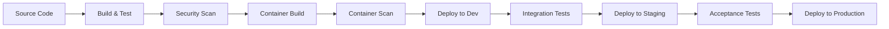
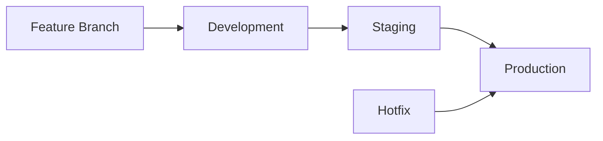

# CI/CD Pipeline Documentation

This document describes the Continuous Integration and Continuous Deployment (CI/CD) pipeline for the Food Service application, including setup, configuration, and best practices.

## Table of Contents

- [Pipeline Overview](#pipeline-overview)
- [GitHub Actions Setup](#github-actions-setup)
- [Azure DevOps Setup](#azure-devops-setup)
- [Jenkins Setup](#jenkins-setup)
- [Build Process](#build-process)
- [Testing Strategy](#testing-strategy)
- [Deployment Process](#deployment-process)
- [Environment Management](#environment-management)
- [Security and Secrets Management](#security-and-secrets-management)
- [Monitoring and Notifications](#monitoring-and-notifications)
- [Troubleshooting](#troubleshooting)

## Pipeline Overview

The CI/CD pipeline follows these stages:



### Pipeline Triggers

- **Pull Request:** Build, test, and security scan
- **Main Branch:** Full pipeline including deployment to staging
- **Release Tag:** Deployment to production
- **Scheduled:** Nightly security scans and dependency updates

## GitHub Actions Setup

### Workflow Configuration

Create `.github/workflows/ci-cd.yml`:

```yaml
name: CI/CD Pipeline

on:
  push:
    branches: [ main, develop ]
  pull_request:
    branches: [ main ]
  release:
    types: [ published ]

env:
  REGISTRY: ghcr.io
  IMAGE_NAME: ${{ github.repository }}

jobs:
  test:
    runs-on: ubuntu-latest
    
    steps:
    - uses: actions/checkout@v4
    
    - name: Set up JDK 17
      uses: actions/setup-java@v4
      with:
        java-version: '17'
        distribution: 'temurin'
        
    - name: Cache Maven dependencies
      uses: actions/cache@v3
      with:
        path: ~/.m2
        key: ${{ runner.os }}-m2-${{ hashFiles('**/pom.xml') }}
        restore-keys: ${{ runner.os }}-m2
        
    - name: Run tests
      run: mvn clean test
      
    - name: Generate test report
      uses: dorny/test-reporter@v1
      if: success() || failure()
      with:
        name: Maven Tests
        path: target/surefire-reports/*.xml
        reporter: java-junit
        
    - name: Upload coverage reports
      uses: codecov/codecov-action@v3
      with:
        file: target/site/jacoco/jacoco.xml
        
  security-scan:
    runs-on: ubuntu-latest
    needs: test
    
    steps:
    - uses: actions/checkout@v4
    
    - name: Run Trivy vulnerability scanner
      uses: aquasecurity/trivy-action@master
      with:
        scan-type: 'fs'
        scan-ref: '.'
        format: 'sarif'
        output: 'trivy-results.sarif'
        
    - name: Upload Trivy scan results
      uses: github/codeql-action/upload-sarif@v2
      with:
        sarif_file: 'trivy-results.sarif'
        
    - name: OWASP Dependency Check
      uses: dependency-check/Dependency-Check_Action@main
      with:
        project: 'food-service'
        path: '.'
        format: 'HTML'
        
  build-and-push:
    runs-on: ubuntu-latest
    needs: [test, security-scan]
    if: github.event_name != 'pull_request'
    
    steps:
    - uses: actions/checkout@v4
    
    - name: Set up JDK 17
      uses: actions/setup-java@v4
      with:
        java-version: '17'
        distribution: 'temurin'
        
    - name: Build application
      run: mvn clean package -DskipTests
      
    - name: Log in to Container Registry
      uses: docker/login-action@v3
      with:
        registry: ${{ env.REGISTRY }}
        username: ${{ github.actor }}
        password: ${{ secrets.GITHUB_TOKEN }}
        
    - name: Extract metadata
      id: meta
      uses: docker/metadata-action@v5
      with:
        images: ${{ env.REGISTRY }}/${{ env.IMAGE_NAME }}
        tags: |
          type=ref,event=branch
          type=ref,event=pr
          type=sha
          type=raw,value=latest,enable={{is_default_branch}}
          
    - name: Build and push Docker image
      uses: docker/build-push-action@v5
      with:
        context: .
        push: true
        tags: ${{ steps.meta.outputs.tags }}
        labels: ${{ steps.meta.outputs.labels }}
        
    - name: Scan container image
      uses: aquasecurity/trivy-action@master
      with:
        image-ref: ${{ env.REGISTRY }}/${{ env.IMAGE_NAME }}:${{ github.sha }}
        format: 'sarif'
        output: 'container-scan-results.sarif'
        
  deploy-dev:
    runs-on: ubuntu-latest
    needs: build-and-push
    if: github.ref == 'refs/heads/develop'
    environment: development
    
    steps:
    - uses: actions/checkout@v4
    
    - name: Configure kubectl
      uses: azure/k8s-set-context@v3
      with:
        method: kubeconfig
        kubeconfig: ${{ secrets.KUBE_CONFIG_DEV }}
        
    - name: Deploy to Development
      run: |
        sed -i 's|IMAGE_TAG|${{ github.sha }}|g' k8s-ssl-deployment.yaml
        kubectl apply -f k8s-ssl-deployment.yaml -n food-service-dev
        kubectl rollout status deployment/food-service -n food-service-dev
        
    - name: Run integration tests
      run: |
        # Wait for deployment
        kubectl wait --for=condition=available --timeout=300s deployment/food-service -n food-service-dev
        # Run API tests
        mvn test -Dtest=IntegrationTest -Dapi.base.url=https://dev.food-service.com
        
  deploy-staging:
    runs-on: ubuntu-latest
    needs: deploy-dev
    if: github.ref == 'refs/heads/main'
    environment: staging
    
    steps:
    - uses: actions/checkout@v4
    
    - name: Configure kubectl
      uses: azure/k8s-set-context@v3
      with:
        method: kubeconfig
        kubeconfig: ${{ secrets.KUBE_CONFIG_STAGING }}
        
    - name: Deploy to Staging
      run: |
        sed -i 's|IMAGE_TAG|${{ github.sha }}|g' k8s-ssl-deployment.yaml
        kubectl apply -f k8s-ssl-deployment.yaml -n food-service-staging
        kubectl rollout status deployment/food-service -n food-service-staging
        
    - name: Run acceptance tests
      run: |
        kubectl wait --for=condition=available --timeout=300s deployment/food-service -n food-service-staging
        mvn test -Dtest=AcceptanceTest -Dapi.base.url=https://staging.food-service.com
        
  deploy-production:
    runs-on: ubuntu-latest
    needs: build-and-push
    if: github.event_name == 'release'
    environment: production
    
    steps:
    - uses: actions/checkout@v4
    
    - name: Configure kubectl
      uses: azure/k8s-set-context@v3
      with:
        method: kubeconfig
        kubeconfig: ${{ secrets.KUBE_CONFIG_PROD }}
        
    - name: Deploy to Production
      run: |
        sed -i 's|IMAGE_TAG|${{ github.ref_name }}|g' k8s-ssl-deployment.yaml
        kubectl apply -f k8s-ssl-deployment.yaml -n food-service-prod
        kubectl rollout status deployment/food-service -n food-service-prod
        
    - name: Health check
      run: |
        kubectl wait --for=condition=available --timeout=300s deployment/food-service -n food-service-prod
        curl -f https://api.food-service.com/actuator/health || exit 1
```

### Required Secrets

Configure these secrets in GitHub repository settings:

- `KUBE_CONFIG_DEV`: Base64 encoded kubeconfig for development cluster
- `KUBE_CONFIG_STAGING`: Base64 encoded kubeconfig for staging cluster  
- `KUBE_CONFIG_PROD`: Base64 encoded kubeconfig for production cluster
- `SONAR_TOKEN`: SonarQube authentication token (if using SonarQube)

## Azure DevOps Setup

### Pipeline Configuration

Create `azure-pipelines.yml`:

```yaml
trigger:
  branches:
    include:
      - main
      - develop
  paths:
    exclude:
      - docs/*
      - README.md

pr:
  branches:
    include:
      - main

variables:
  - group: food-service-vars
  - name: imageName
    value: 'food-service'
  - name: dockerRegistryServiceConnection
    value: 'food-service-acr'

stages:
- stage: Build
  displayName: Build and Test
  jobs:
  - job: Test
    displayName: Run Tests
    pool:
      vmImage: 'ubuntu-latest'
    steps:
    - task: Maven@3
      displayName: 'Maven Test'
      inputs:
        mavenPomFile: 'pom.xml'
        goals: 'clean test'
        options: '-Dmaven.test.failure.ignore=true'
        publishJUnitResults: true
        testResultsFiles: '**/surefire-reports/TEST-*.xml'
        codeCoverageToolOption: 'JaCoCo'
        
    - task: PublishCodeCoverageResults@1
      displayName: 'Publish Code Coverage'
      inputs:
        codeCoverageTool: 'JaCoCo'
        summaryFileLocation: '$(System.DefaultWorkingDirectory)/target/site/jacoco/jacoco.xml'
        
    - task: SonarQubePrepare@4
      displayName: 'Prepare SonarQube Analysis'
      inputs:
        SonarQube: 'SonarQube-Connection'
        scannerMode: 'Other'
        
    - task: Maven@3
      displayName: 'Maven SonarQube'
      inputs:
        mavenPomFile: 'pom.xml'
        goals: 'sonar:sonar'
        
    - task: SonarQubePublish@4
      displayName: 'Publish SonarQube Results'

- stage: Security
  displayName: Security Scan
  dependsOn: Build
  jobs:
  - job: SecurityScan
    displayName: Security Scanning
    pool:
      vmImage: 'ubuntu-latest'
    steps:
    - task: dependency-check-build-task@6
      displayName: 'OWASP Dependency Check'
      inputs:
        projectName: 'food-service'
        scanPath: '.'
        format: 'ALL'
        
    - task: PublishTestResults@2
      displayName: 'Publish Security Test Results'
      inputs:
        testResultsFormat: 'JUnit'
        testResultsFiles: '**/dependency-check-junit.xml'
        
- stage: BuildImage
  displayName: Build Container Image
  dependsOn: Security
  condition: ne(variables['Build.Reason'], 'PullRequest')
  jobs:
  - job: BuildImage
    displayName: Build and Push Image
    pool:
      vmImage: 'ubuntu-latest'
    steps:
    - task: Maven@3
      displayName: 'Maven Package'
      inputs:
        mavenPomFile: 'pom.xml'
        goals: 'clean package'
        options: '-DskipTests'
        
    - task: Docker@2
      displayName: 'Build and Push Image'
      inputs:
        containerRegistry: '$(dockerRegistryServiceConnection)'
        repository: '$(imageName)'
        command: 'buildAndPush'
        Dockerfile: '**/Dockerfile'
        tags: |
          $(Build.BuildId)
          latest

- stage: DeployDev
  displayName: Deploy to Development
  dependsOn: BuildImage
  condition: and(succeeded(), eq(variables['Build.SourceBranch'], 'refs/heads/develop'))
  jobs:
  - deployment: DeployDev
    displayName: Deploy to Development
    environment: 'food-service-dev'
    pool:
      vmImage: 'ubuntu-latest'
    strategy:
      runOnce:
        deploy:
          steps:
          - task: KubernetesManifest@0
            displayName: 'Deploy to Kubernetes'
            inputs:
              action: 'deploy'
              kubernetesServiceConnection: 'k8s-dev-connection'
              namespace: 'food-service-dev'
              manifests: |
                k8s-ssl-deployment.yaml
              containers: '$(containerRegistry)/$(imageName):$(Build.BuildId)'
```

## Build Process

### Maven Configuration

Ensure your `pom.xml` includes necessary plugins:

```xml
<plugin>
    <groupId>org.jacoco</groupId>
    <artifactId>jacoco-maven-plugin</artifactId>
    <version>0.8.8</version>
    <executions>
        <execution>
            <goals>
                <goal>prepare-agent</goal>
            </goals>
        </execution>
        <execution>
            <id>report</id>
            <phase>test</phase>
            <goals>
                <goal>report</goal>
            </goals>
        </execution>
    </executions>
</plugin>

<plugin>
    <groupId>org.sonarsource.scanner.maven</groupId>
    <artifactId>sonar-maven-plugin</artifactId>
    <version>3.9.1.2184</version>
</plugin>

<plugin>
    <groupId>org.owasp</groupId>
    <artifactId>dependency-check-maven</artifactId>
    <version>8.4.0</version>
    <configuration>
        <failBuildOnCVSS>7</failBuildOnCVSS>
        <formats>
            <format>HTML</format>
            <format>XML</format>
        </formats>
    </configuration>
</plugin>
```

### Build Optimization

```dockerfile
# Multi-stage Dockerfile for optimization
FROM maven:3.9-openjdk-17-slim AS build
WORKDIR /app
COPY pom.xml .
RUN mvn dependency:go-offline -B
COPY src ./src
RUN mvn clean package -DskipTests

FROM openjdk:17-jre-slim
RUN addgroup --system spring && adduser --system spring --ingroup spring
USER spring:spring
COPY --from=build /app/target/*.jar app.jar
EXPOSE 8443
ENTRYPOINT ["java", "-jar", "/app.jar"]
```

## Testing Strategy

### Test Types and Execution

1. **Unit Tests**
   ```bash
   mvn test
   ```

2. **Integration Tests**
   ```bash
   mvn test -Dtest=IntegrationTest
   ```

3. **Contract Tests**
   ```bash
   mvn test -Dtest=ContractTest
   ```

4. **Security Tests**
   ```bash
   mvn org.owasp:dependency-check-maven:check
   ```

### Test Quality Gates

- Unit test coverage: ≥ 80%
- Integration test coverage: ≥ 70%
- No critical security vulnerabilities
- No high-severity code smells

## Deployment Process

### Environment Promotion



### Deployment Strategies

1. **Rolling Deployment** (Default)
   ```yaml
   strategy:
     type: RollingUpdate
     rollingUpdate:
       maxUnavailable: 1
       maxSurge: 1
   ```

2. **Blue-Green Deployment**
   ```bash
   # Switch traffic between versions
   kubectl patch service food-service -p '{"spec":{"selector":{"version":"v2"}}}'
   ```

3. **Canary Deployment**
   ```yaml
   # Istio virtual service for canary
   spec:
     http:
     - match:
       - headers:
           canary:
             exact: "true"
       route:
       - destination:
           host: food-service
           subset: canary
     - route:
       - destination:
           host: food-service
           subset: stable
   ```

## Environment Management

### Environment Configuration

| Environment | Purpose | Approval Required | Auto Deploy |
|-------------|---------|-------------------|-------------|
| Development | Feature testing | No | Yes (develop branch) |
| Staging | Integration testing | No | Yes (main branch) |
| Production | Live service | Yes | Manual/Tagged release |

### Environment Variables

```yaml
# ConfigMap for environment-specific settings
apiVersion: v1
kind: ConfigMap
metadata:
  name: food-service-config
data:
  SPRING_PROFILES_ACTIVE: "production"
  LOGGING_LEVEL_ROOT: "INFO"
  MANAGEMENT_ENDPOINTS_WEB_EXPOSURE_INCLUDE: "health,info,metrics"
```

## Security and Secrets Management

### Secret Management

```bash
# Create secret for SSL certificates
kubectl create secret tls food-service-ssl \
  --cert=cert.pem \
  --key=key.pem \
  -n food-service

# Create secret for database credentials
kubectl create secret generic food-service-db \
  --from-literal=username=dbuser \
  --from-literal=password=dbpass \
  -n food-service
```

### Security Scanning

1. **Static Code Analysis**
   - SonarQube for code quality
   - SpotBugs for bug detection
   - PMD for code analysis

2. **Dependency Scanning**
   - OWASP Dependency Check
   - Snyk for vulnerability detection
   - Trivy for comprehensive scanning

3. **Container Scanning**
   - Trivy for container vulnerabilities
   - Hadolint for Dockerfile best practices

## Monitoring and Notifications

### Pipeline Monitoring

```yaml
# Slack notification configuration
- name: Notify Slack
  uses: 8398a7/action-slack@v3
  with:
    status: ${{ job.status }}
    channel: '#deployments'
    webhook_url: ${{ secrets.SLACK_WEBHOOK }}
  if: always()
```

### Deployment Monitoring

```bash
# Health check after deployment
kubectl wait --for=condition=available --timeout=300s deployment/food-service -n food-service
curl -f https://api.food-service.com/actuator/health || exit 1
```

## Troubleshooting

### Common Pipeline Issues

1. **Build Failures**
   ```bash
   # Check build logs
   mvn clean compile -X
   
   # Dependency conflicts
   mvn dependency:tree
   ```

2. **Test Failures**
   ```bash
   # Run specific test
   mvn test -Dtest=ClassName#methodName
   
   # Skip tests temporarily
   mvn package -DskipTests
   ```

3. **Deployment Issues**
   ```bash
   # Check deployment status
   kubectl rollout status deployment/food-service -n food-service
   
   # Rollback deployment
   kubectl rollout undo deployment/food-service -n food-service
   ```

### Pipeline Debugging

```bash
# GitHub Actions debugging
echo "::debug::Debug message"
echo "::set-output name=result::value"

# Azure DevOps debugging
echo "##vso[task.debug]Debug message"
echo "##vso[task.setvariable variable=result]value"
```

## Best Practices

### Pipeline Best Practices

1. **Fail Fast**: Run quick tests first
2. **Parallel Execution**: Run independent jobs concurrently
3. **Caching**: Cache dependencies to reduce build time
4. **Secrets**: Never hardcode secrets in pipeline files
5. **Notifications**: Alert on failures and deployments

### Security Best Practices

1. **Least Privilege**: Use minimal required permissions
2. **Secret Rotation**: Regularly rotate secrets and tokens
3. **Audit Logs**: Maintain logs of all pipeline activities
4. **Vulnerability Scanning**: Scan at multiple stages
5. **Compliance**: Follow organizational security policies

---

**Last Updated:** [Current Date]
**Document Owner:** [DevOps Team]
**Review Schedule:** Quarterly
