# Security Documentation

## 🔐 Security Overview

The Food Service application implements comprehensive security measures to protect data, ensure secure communication, and maintain system integrity. This document outlines the security architecture, implementation details, and best practices.

## 📋 Table of Contents

- [Security Architecture](#security-architecture)
- [SSL/TLS Implementation](#ssltls-implementation)
- [Certificate Management](#certificate-management)
- [Input Validation](#input-validation)
- [Error Handling Security](#error-handling-security)
- [Container Security](#container-security)
- [Kubernetes Security](#kubernetes-security)
- [Azure Security](#azure-security)
- [Security Testing](#security-testing)
- [Security Monitoring](#security-monitoring)
- [Security Best Practices](#security-best-practices)
- [Incident Response](#incident-response)
- [Compliance](#compliance)

## 🏗️ Security Architecture

### Defense in Depth

```mermaid
graph TB
    Internet[🌐 Internet] --> WAF[🛡️ Web Application Firewall]
    WAF --> LB[🔄 Azure Load Balancer]
    LB --> K8S[☸️ Kubernetes Cluster]
    
    subgraph "Network Security"
        K8S --> NSG[🛡️ Network Security Groups]
        NSG --> Pod[🐳 Application Pods]
    end
    
    subgraph "Application Security"
        Pod --> TLS[🔒 TLS/HTTPS]
        Pod --> Validation[✅ Input Validation]
        Pod --> Auth[🔑 Authentication]
        Pod --> Logging[📋 Security Logging]
    end
    
    subgraph "Infrastructure Security"
        Pod --> RBAC[👥 RBAC]
        Pod --> Secrets[🔐 K8s Secrets]
        Pod --> Scanner[🔍 Vulnerability Scanner]
    end
```



### Security Layers

| Layer | Security Controls | Implementation |
|-------|-------------------|----------------|
| **Network** | Firewalls, Load Balancers, NSGs | Azure infrastructure |
| **Transport** | TLS 1.2+, Certificate validation | Spring Boot SSL |
| **Application** | Input validation, Error handling | Custom implementation |
| **Container** | Image scanning, Non-root user | Docker best practices |
| **Platform** | RBAC, Secrets, Network policies | Kubernetes security |

## 🔒 SSL/TLS Implementation

### TLS Configuration

```yaml
# application-ssl.yml
server:
  port: 8443
  ssl:
    enabled: true
    key-store: classpath:ssl/keystore.p12
    key-store-password: ${SSL_KEYSTORE_PASSWORD:changeit}
    key-store-type: PKCS12
    key-alias: food-service-cert
    protocol: TLS
    enabled-protocols: TLSv1.2,TLSv1.3
    ciphers: >
      TLS_ECDHE_RSA_WITH_AES_256_GCM_SHA384,
      TLS_ECDHE_RSA_WITH_AES_128_GCM_SHA256,
      TLS_ECDHE_RSA_WITH_AES_256_CBC_SHA384,
      TLS_ECDHE_RSA_WITH_AES_128_CBC_SHA256
```

### Security Headers

```java
@Configuration
@EnableWebSecurity
public class SecurityConfig {
    
    @Bean
    public SecurityFilterChain filterChain(HttpSecurity http) throws Exception {
        http.headers(headers -> headers
            .frameOptions().deny()
            .contentTypeOptions().and()
            .httpStrictTransportSecurity(hstsConfig -> hstsConfig
                .maxAgeInSeconds(31536000)
                .includeSubdomains(true)
                .preload(true)
            )
            .and()
            .addHeaderWriter(new StaticHeadersWriter("X-Content-Type-Options", "nosniff"))
            .addHeaderWriter(new StaticHeadersWriter("X-Frame-Options", "DENY"))
            .addHeaderWriter(new StaticHeadersWriter("X-XSS-Protection", "1; mode=block"))
            .addHeaderWriter(new StaticHeadersWriter("Referrer-Policy", "strict-origin-when-cross-origin"))
        );
        
        return http.build();
    }
}
```

### TLS Best Practices

**Configuration Checklist**:
- ✅ TLS 1.2 minimum version
- ✅ Strong cipher suites only
- ✅ Perfect Forward Secrecy (PFS)
- ✅ HSTS headers enabled
- ✅ Certificate validation
- ✅ Secure key storage

**Security Headers Implemented**:
```http
Strict-Transport-Security: max-age=31536000; includeSubDomains; preload
X-Content-Type-Options: nosniff
X-Frame-Options: DENY
X-XSS-Protection: 1; mode=block
Referrer-Policy: strict-origin-when-cross-origin
```

## 📜 Certificate Management

### Self-Signed Certificate (Development)

```powershell
# Generate self-signed certificate
New-SelfSignedCertificate -DnsName "localhost" `
    -CertStoreLocation "cert:\LocalMachine\My" `
    -NotAfter (Get-Date).AddYears(1) `
    -KeyLength 2048 `
    -KeyAlgorithm RSA `
    -HashAlgorithm SHA256
```

### Certificate Details

```yaml
Certificate Information:
  Type: PKCS12 (.p12)
  Algorithm: RSA 2048-bit
  Hash: SHA-256
  Subject: CN=localhost
  Validity: 365 days
  Usage: Digital Signature, Key Encipherment
  Extended Usage: Server Authentication
```

### Production Certificate Management

#### Let's Encrypt Integration

```bash
# Install certbot
sudo apt-get install certbot

# Generate certificate
certbot certonly --standalone -d yourdomain.com

# Convert to PKCS12
openssl pkcs12 -export \
    -in /etc/letsencrypt/live/yourdomain.com/fullchain.pem \
    -inkey /etc/letsencrypt/live/yourdomain.com/privkey.pem \
    -out keystore.p12 \
    -name food-service-cert \
    -passout pass:$KEYSTORE_PASSWORD
```

#### Azure Key Vault Integration

```yaml
# Production configuration
azure:
  keyvault:
    uri: https://food-service-kv.vault.azure.net/
    
server:
  ssl:
    key-store: ${azure.keyvault.uri}secrets/ssl-certificate
    key-store-password: ${azure.keyvault.uri}secrets/ssl-password
```

```java
@Configuration
@EnableConfigurationProperties(AzureKeyVaultProperties.class)
public class KeyVaultConfig {
    
    @Bean
    public SecretClient secretClient(AzureKeyVaultProperties properties) {
        return new SecretClientBuilder()
            .vaultUrl(properties.getUri())
            .credential(new DefaultAzureCredentialBuilder().build())
            .buildClient();
    }
}
```

### Certificate Rotation

```bash
#!/bin/bash
# Certificate rotation script
CERT_PATH="/app/ssl/keystore.p12"
BACKUP_PATH="/app/ssl/backup/"

# Backup current certificate
cp $CERT_PATH $BACKUP_PATH/keystore-$(date +%Y%m%d).p12

# Deploy new certificate
kubectl create secret tls food-service-tls \
    --cert=new-cert.pem \
    --key=new-key.pem \
    --namespace=food-service-ssl

# Rolling restart pods
kubectl rollout restart deployment/food-service-ssl-deployment \
    --namespace=food-service-ssl
```

## ✅ Input Validation

### Request Validation

```java
@RestController
@RequestMapping("/api/foods")
@Validated
public class FoodController {
    
    @GetMapping("/{id}")
    public ResponseEntity<Food> getFoodItemById(
            @PathVariable @Min(1) @Max(Integer.MAX_VALUE) Integer id) {
        // Validation ensures id is positive integer
        Food food = foodService.getFoodItemById(id);
        return ResponseEntity.ok(food);
    }
    
    @GetMapping("/search")
    public ResponseEntity<List<Food>> searchFoodItemsByName(
            @RequestParam @NotBlank @Size(min = 1, max = 100) String name) {
        // Validation ensures name is not empty and within limits
        String sanitizedName = sanitizeInput(name);
        List<Food> foods = foodService.searchFoodItemsByName(sanitizedName);
        return ResponseEntity.ok(foods);
    }
    
    private String sanitizeInput(String input) {
        // Remove potentially harmful characters
        return input.replaceAll("[<>\"'%;()&+]", "");
    }
}
```

### Validation Annotations

```java
public class Food {
    @NotNull(message = "ID cannot be null")
    @Min(value = 1, message = "ID must be positive")
    private Integer id;
    
    @NotBlank(message = "Name cannot be empty")
    @Size(max = 100, message = "Name cannot exceed 100 characters")
    @Pattern(regexp = "^[a-zA-Z0-9\\s]+$", message = "Name contains invalid characters")
    private String name;
    
    @Pattern(regexp = "^\\$\\d+\\.\\d{2}$", message = "Invalid price format")
    private String price;
    
    @Size(max = 500, message = "Description cannot exceed 500 characters")
    private String description;
    
    @Min(value = 0, message = "Calories cannot be negative")
    @Max(value = 5000, message = "Calories cannot exceed 5000")
    private Integer calories;
}
```

### SQL Injection Prevention

Although the current implementation uses XML data, future database integration should follow these practices:

```java
// Good: Parameterized queries
@Query("SELECT f FROM Food f WHERE f.name LIKE :name")
List<Food> findByNameContaining(@Param("name") String name);

// Bad: String concatenation (vulnerable to SQL injection)
// "SELECT * FROM food WHERE name LIKE '" + name + "'"
```

### XSS Prevention

```java
@Component
public class XSSFilter implements Filter {
    
    @Override
    public void doFilter(ServletRequest request, ServletResponse response, 
                        FilterChain chain) throws IOException, ServletException {
        
        XSSRequestWrapper wrappedRequest = new XSSRequestWrapper((HttpServletRequest) request);
        chain.doFilter(wrappedRequest, response);
    }
}

public class XSSRequestWrapper extends HttpServletRequestWrapper {
    
    @Override
    public String getParameter(String parameter) {
        String value = super.getParameter(parameter);
        return sanitizeInput(value);
    }
    
    private String sanitizeInput(String value) {
        if (value == null) return null;
        
        // Remove script tags and dangerous content
        value = value.replaceAll("<script[^>]*>.*?</script>", "");
        value = value.replaceAll("<[^>]+>", "");
        value = value.replaceAll("javascript:", "");
        value = value.replaceAll("on\\w+\\s*=", "");
        
        return value;
    }
}
```

## 🛡️ Error Handling Security

### Secure Error Responses

```java
@ControllerAdvice
public class CustomExceptionHandler {
    
    private static final Logger logger = LoggerFactory.getLogger(CustomExceptionHandler.class);
    
    @ExceptionHandler(FoodNotFoundException.class)
    public ResponseEntity<ErrorResponse> handleFoodNotFound(FoodNotFoundException ex) {
        // Log with correlation ID but don't expose internal details
        String correlationId = UUID.randomUUID().toString();
        logger.warn("Food not found - Correlation ID: {}, Message: {}", correlationId, ex.getMessage());
        
        ErrorResponse error = ErrorResponse.builder()
            .timestamp(LocalDateTime.now())
            .status(HttpStatus.NOT_FOUND.value())
            .error("Not Found")
            .message("The requested food item was not found")  // Generic message
            .path(getCurrentPath())
            .correlationId(correlationId)
            .build();
            
        return ResponseEntity.status(HttpStatus.NOT_FOUND).body(error);
    }
    
    @ExceptionHandler(Exception.class)
    public ResponseEntity<ErrorResponse> handleGenericException(Exception ex) {
        String correlationId = UUID.randomUUID().toString();
        // Log full exception details for debugging
        logger.error("Unexpected error - Correlation ID: {}", correlationId, ex);
        
        // Return generic error message to client
        ErrorResponse error = ErrorResponse.builder()
            .timestamp(LocalDateTime.now())
            .status(HttpStatus.INTERNAL_SERVER_ERROR.value())
            .error("Internal Server Error")
            .message("An unexpected error occurred. Please try again later.")
            .correlationId(correlationId)
            .build();
            
        return ResponseEntity.status(HttpStatus.INTERNAL_SERVER_ERROR).body(error);
    }
}
```

### Information Disclosure Prevention

```yaml
# Don't expose sensitive information in error responses
server:
  error:
    include-stacktrace: never
    include-message: never
    include-binding-errors: never

# Security logging configuration
logging:
  level:
    com.example.foodservice: INFO
    org.springframework.security: WARN
    root: WARN
  pattern:
    console: "%d{yyyy-MM-dd HH:mm:ss} - %msg%n"
    file: "%d{yyyy-MM-dd HH:mm:ss} [%thread] %-5level %logger{36} - %msg%n"
```

## 🐳 Container Security

### Dockerfile Security Best Practices

```dockerfile
# Use official, minimal base image
FROM openjdk:17-jdk-slim as builder

# Create non-root user
RUN groupadd -r appgroup && useradd -r -g appgroup appuser

# Build stage - security scanning
WORKDIR /app
COPY . .
RUN ./mvnw clean package -DskipTests

# Production stage
FROM openjdk:17-jdk-slim

# Install security updates
RUN apt-get update && \
    apt-get upgrade -y && \
    apt-get install -y --no-install-recommends \
        ca-certificates && \
    rm -rf /var/lib/apt/lists/*

# Create non-root user
RUN groupadd -r appgroup && useradd -r -g appgroup appuser

# Set working directory
WORKDIR /app

# Copy application with correct ownership
COPY --from=builder --chown=appuser:appgroup /app/target/food-service-0.0.1-SNAPSHOT.jar app.jar

# Switch to non-root user
USER appuser

# Remove unnecessary capabilities
EXPOSE 8080 8443

# Health check
HEALTHCHECK --interval=30s --timeout=10s --start-period=30s --retries=3 \
    CMD curl -f http://localhost:8080/actuator/health || exit 1

# Start application
ENTRYPOINT ["java", "-XX:+UseContainerSupport", "-XX:MaxRAMPercentage=75.0", "-jar", "app.jar"]
```

### Image Security Scanning

```yaml
# GitHub Actions security scanning
name: Security Scan
on: [push, pull_request]

jobs:
  security-scan:
    runs-on: ubuntu-latest
    steps:
      - uses: actions/checkout@v3
      
      - name: Build Docker image
        run: docker build -t food-service:${{ github.sha }} .
        
      - name: Run Trivy vulnerability scanner
        uses: aquasecurity/trivy-action@master
        with:
          image-ref: 'food-service:${{ github.sha }}'
          format: 'sarif'
          output: 'trivy-results.sarif'
          
      - name: Upload Trivy scan results
        uses: github/codeql-action/upload-sarif@v2
        with:
          sarif_file: 'trivy-results.sarif'
```

### Container Runtime Security

```yaml
# Kubernetes security context
apiVersion: apps/v1
kind: Deployment
spec:
  template:
    spec:
      securityContext:
        runAsNonRoot: true
        runAsUser: 1000
        runAsGroup: 1000
        fsGroup: 1000
        seccompProfile:
          type: RuntimeDefault
      containers:
      - name: food-service
        securityContext:
          allowPrivilegeEscalation: false
          readOnlyRootFilesystem: true
          runAsNonRoot: true
          runAsUser: 1000
          capabilities:
            drop:
              - ALL
            add:
              - NET_BIND_SERVICE
        resources:
          limits:
            memory: "256Mi"
            cpu: "200m"
          requests:
            memory: "128Mi"
            cpu: "100m"
```

## ☸️ Kubernetes Security

### Network Policies

```yaml
apiVersion: networking.k8s.io/v1
kind: NetworkPolicy
metadata:
  name: food-service-network-policy
  namespace: food-service-ssl
spec:
  podSelector:
    matchLabels:
      app: food-service-ssl
  policyTypes:
  - Ingress
  - Egress
  ingress:
  - from:
    - namespaceSelector:
        matchLabels:
          name: ingress-nginx
    ports:
    - protocol: TCP
      port: 8443
    - protocol: TCP
      port: 8080
  egress:
  - to: []
    ports:
    - protocol: TCP
      port: 53  # DNS
    - protocol: UDP
      port: 53  # DNS
    - protocol: TCP
      port: 443  # HTTPS outbound
```

### Pod Security Standards

```yaml
apiVersion: v1
kind: Namespace
metadata:
  name: food-service-ssl
  labels:
    pod-security.kubernetes.io/enforce: restricted
    pod-security.kubernetes.io/audit: restricted
    pod-security.kubernetes.io/warn: restricted
```

### RBAC Configuration

```yaml
apiVersion: rbac.authorization.k8s.io/v1
kind: Role
metadata:
  namespace: food-service-ssl
  name: food-service-role
rules:
- apiGroups: [""]
  resources: ["configmaps", "secrets"]
  verbs: ["get", "list"]

---
apiVersion: rbac.authorization.k8s.io/v1
kind: RoleBinding
metadata:
  name: food-service-binding
  namespace: food-service-ssl
subjects:
- kind: ServiceAccount
  name: food-service-sa
  namespace: food-service-ssl
roleRef:
  kind: Role
  name: food-service-role
  apiGroup: rbac.authorization.k8s.io

---
apiVersion: v1
kind: ServiceAccount
metadata:
  name: food-service-sa
  namespace: food-service-ssl
automountServiceAccountToken: false
```

### Secrets Management

```yaml
# SSL certificate secret
apiVersion: v1
kind: Secret
metadata:
  name: food-service-ssl-secret
  namespace: food-service-ssl
type: kubernetes.io/tls
data:
  tls.crt: LS0tLS1CRUdJTi... # Base64 encoded certificate
  tls.key: LS0tLS1CRUdJTi... # Base64 encoded private key

---
# Application secrets
apiVersion: v1
kind: Secret
metadata:
  name: food-service-config-secret
  namespace: food-service-ssl
type: Opaque
data:
  ssl-password: Y2hhbmdlaXQ=  # Base64 encoded "changeit"
  api-key: <base64-encoded-api-key>
```

### Pod Security Admission

```yaml
apiVersion: apps/v1
kind: Deployment
metadata:
  name: food-service-ssl-deployment
spec:
  template:
    metadata:
      annotations:
        container.apparmor.security.beta.kubernetes.io/food-service: runtime/default
    spec:
      securityContext:
        runAsNonRoot: true
        runAsUser: 65534
        runAsGroup: 65534
        fsGroup: 65534
        supplementalGroups: [65534]
        seccompProfile:
          type: RuntimeDefault
```

## ☁️ Azure Security

### Azure Security Center

```bash
# Enable Azure Security Center
az security auto-provisioning-setting update \
    --name default \
    --auto-provision on

# Enable just-in-time VM access
az security jit-policy create \
    --resource-group rg-food-service \
    --location eastus \
    --name food-service-jit \
    --virtual-machines "/subscriptions/{subscription-id}/resourceGroups/rg-food-service/providers/Microsoft.Compute/virtualMachines/{vm-name}"
```

### Azure Key Vault

```bash
# Create Key Vault
az keyvault create \
    --name food-service-kv \
    --resource-group rg-food-service \
    --location eastus \
    --enable-rbac-authorization

# Store SSL certificate
az keyvault certificate import \
    --vault-name food-service-kv \
    --name ssl-certificate \
    --file certificate.pfx \
    --password $CERT_PASSWORD

# Store application secrets
az keyvault secret set \
    --vault-name food-service-kv \
    --name ssl-password \
    --value "changeit"
```

### Azure Monitor Security

```yaml
# Log Analytics workspace
resource "azurerm_log_analytics_workspace" "food_service" {
  name                = "food-service-logs"
  resource_group_name = azurerm_resource_group.main.name
  location            = azurerm_resource_group.main.location
  sku                 = "PerGB2018"
  retention_in_days   = 30
}

# Security Center alerts
resource "azurerm_monitor_action_group" "security" {
  name                = "security-alerts"
  resource_group_name = azurerm_resource_group.main.name
  short_name          = "security"

  email_receiver {
    name          = "security-team"
    email_address = "security@company.com"
  }
}
```

## 🧪 Security Testing

### Static Code Analysis

```yaml
# SonarQube security analysis
name: Security Analysis
on: [push, pull_request]

jobs:
  sonarqube:
    runs-on: ubuntu-latest
    steps:
      - uses: actions/checkout@v3
      
      - name: Set up JDK 17
        uses: actions/setup-java@v3
        with:
          java-version: '17'
          
      - name: Run tests
        run: mvn clean test
        
      - name: SonarQube analysis
        env:
          GITHUB_TOKEN: ${{ secrets.GITHUB_TOKEN }}
          SONAR_TOKEN: ${{ secrets.SONAR_TOKEN }}
        run: mvn sonar:sonar -Dsonar.projectKey=food-service
```

### Dependency Vulnerability Scanning

```xml
<!-- OWASP Dependency Check Maven Plugin -->
<plugin>
    <groupId>org.owasp</groupId>
    <artifactId>dependency-check-maven</artifactId>
    <version>8.4.0</version>
    <configuration>
        <failBuildOnAnyVulnerability>true</failBuildOnAnyVulnerability>
        <suppressionFiles>
            <suppressionFile>dependency-check-suppressions.xml</suppressionFile>
        </suppressionFiles>
    </configuration>
    <executions>
        <execution>
            <goals>
                <goal>check</goal>
            </goals>
        </execution>
    </executions>
</plugin>
```

### Penetration Testing

```bash
# OWASP ZAP automated security testing
#!/bin/bash

# Start ZAP daemon
docker run -u zap -p 8080:8080 -d --name zap owasp/zap2docker-stable zap.sh -daemon -host 0.0.0.0 -port 8080

# Wait for ZAP to start
sleep 30

# Spider scan
curl "http://localhost:8080/JSON/spider/action/scan/?url=https://your-app-url"

# Active scan
curl "http://localhost:8080/JSON/ascan/action/scan/?url=https://your-app-url"

# Generate report
curl "http://localhost:8080/JSON/core/other/htmlreport/" > security-report.html

# Clean up
docker stop zap && docker rm zap
```

### Security Test Cases

```java
@SpringBootTest
@TestPropertySource(properties = "spring.profiles.active=test")
class SecurityTest {
    
    @Autowired
    private TestRestTemplate restTemplate;
    
    @Test
    void shouldRejectMaliciousInput() {
        String maliciousInput = "<script>alert('xss')</script>";
        
        ResponseEntity<String> response = restTemplate.getForEntity(
            "/api/foods/search?name=" + maliciousInput, String.class);
            
        assertThat(response.getStatusCode()).isEqualTo(HttpStatus.BAD_REQUEST);
    }
    
    @Test
    void shouldEnforceHttpsRedirect() {
        ResponseEntity<String> response = restTemplate.getForEntity(
            "http://localhost:8080/api/foods", String.class);
            
        // Should redirect to HTTPS
        assertThat(response.getHeaders().getLocation().getScheme()).isEqualTo("https");
    }
    
    @Test
    void shouldIncludeSecurityHeaders() {
        HttpHeaders headers = restTemplate.getForEntity(
            "/api/foods", String.class).getHeaders();
            
        assertThat(headers.get("X-Content-Type-Options")).contains("nosniff");
        assertThat(headers.get("X-Frame-Options")).contains("DENY");
        assertThat(headers.get("Strict-Transport-Security")).isNotEmpty();
    }
}
```

## 📊 Security Monitoring

### Logging Security Events

```java
@Component
public class SecurityLogger {
    
    private static final Logger securityLogger = LoggerFactory.getLogger("SECURITY");
    
    public void logSuccessfulLogin(String username, String ip) {
        securityLogger.info("LOGIN_SUCCESS user={} ip={} timestamp={}", 
            username, ip, Instant.now());
    }
    
    public void logFailedLogin(String username, String ip) {
        securityLogger.warn("LOGIN_FAILED user={} ip={} timestamp={}", 
            username, ip, Instant.now());
    }
    
    public void logSuspiciousActivity(String activity, String ip, String details) {
        securityLogger.error("SUSPICIOUS_ACTIVITY activity={} ip={} details={} timestamp={}", 
            activity, ip, details, Instant.now());
    }
}
```

### Security Metrics

```java
@Component
public class SecurityMetrics {
    
    private final MeterRegistry meterRegistry;
    private final Counter authFailures;
    private final Counter suspiciousRequests;
    
    public SecurityMetrics(MeterRegistry meterRegistry) {
        this.meterRegistry = meterRegistry;
        this.authFailures = Counter.builder("security.auth.failures")
            .description("Authentication failures")
            .register(meterRegistry);
        this.suspiciousRequests = Counter.builder("security.suspicious.requests")
            .description("Suspicious requests detected")
            .register(meterRegistry);
    }
    
    public void recordAuthFailure() {
        authFailures.increment();
    }
    
    public void recordSuspiciousRequest() {
        suspiciousRequests.increment();
    }
}
```

### Alerting Rules

```yaml
# Prometheus alerting rules
groups:
- name: security.rules
  rules:
  - alert: HighAuthFailureRate
    expr: rate(security_auth_failures_total[5m]) > 5
    for: 2m
    labels:
      severity: warning
    annotations:
      summary: "High authentication failure rate detected"
      description: "Authentication failure rate is {{ $value }} per second"
      
  - alert: SuspiciousActivity
    expr: increase(security_suspicious_requests_total[5m]) > 10
    for: 1m
    labels:
      severity: critical
    annotations:
      summary: "Suspicious activity detected"
      description: "{{ $value }} suspicious requests in the last 5 minutes"
```

## 🚨 Incident Response

### Security Incident Playbook

#### 1. Detection and Analysis
```bash
# Check for security alerts
kubectl logs -l app=food-service-ssl --tail=1000 | grep "ERROR\|WARN"

# Check application metrics
curl http://localhost:8080/actuator/metrics/security.auth.failures

# Review access logs
kubectl logs ingress-nginx-controller -n ingress-nginx | grep "40[13]"
```

#### 2. Containment
```bash
# Scale down affected pods
kubectl scale deployment food-service-ssl-deployment --replicas=0

# Block suspicious IP addresses
kubectl apply -f - <<EOF
apiVersion: networking.k8s.io/v1
kind: NetworkPolicy
metadata:
  name: block-malicious-ips
spec:
  podSelector:
    matchLabels:
      app: food-service-ssl
  policyTypes:
  - Ingress
  ingress:
  - from:
    - ipBlock:
        cidr: 0.0.0.0/0
        except:
        - 192.168.1.100/32  # Blocked IP
EOF
```

#### 3. Eradication
```bash
# Update to patched version
kubectl set image deployment/food-service-ssl-deployment \
    food-service-ssl=yourregistry/food-service:patched-version

# Rotate secrets
kubectl delete secret food-service-ssl-secret
kubectl create secret tls food-service-ssl-secret \
    --cert=new-cert.pem --key=new-key.pem
```

#### 4. Recovery
```bash
# Scale back up with new version
kubectl scale deployment food-service-ssl-deployment --replicas=2

# Verify health
kubectl get pods -l app=food-service-ssl
curl -k https://your-domain/actuator/health
```

### Communication Templates

```markdown
## Security Incident Notification

**Incident ID**: SEC-2024-001
**Severity**: High
**Status**: Investigating

**Summary**: Suspicious login attempts detected on Food Service API

**Impact**: No confirmed data breach. Service remains operational.

**Actions Taken**:
- Increased monitoring and alerting
- Blocked suspicious IP addresses
- Initiated security scan

**Next Steps**:
- Complete forensic analysis
- Update security policies
- Conduct lessons learned session

**Contact**: security-team@company.com
```

## 📋 Compliance

### Security Checklist

#### Development Security
- [x] Secure coding practices implemented
- [x] Input validation on all endpoints
- [x] Output encoding for responses
- [x] Error handling doesn't expose sensitive information
- [x] Logging includes security events
- [x] Dependencies regularly updated

#### Infrastructure Security
- [x] TLS 1.2+ for all communications
- [x] Strong cipher suites configured
- [x] Security headers implemented
- [x] Container runs as non-root user
- [x] Minimal container attack surface
- [x] Network policies restrict traffic

#### Operational Security
- [x] Secrets stored securely (Key Vault)
- [x] RBAC implemented in Kubernetes
- [x] Regular security scanning
- [x] Incident response plan documented
- [x] Security monitoring and alerting
- [x] Regular security assessments

### Compliance Standards

#### OWASP Top 10 Mitigation

| Risk | Mitigation | Implementation |
|------|------------|----------------|
| A01: Broken Access Control | RBAC, input validation | Kubernetes RBAC, parameter validation |
| A02: Cryptographic Failures | Strong encryption | TLS 1.2+, secure key storage |
| A03: Injection | Input sanitization | Parameter validation, prepared statements |
| A04: Insecure Design | Secure architecture | Defense in depth, secure defaults |
| A05: Security Misconfiguration | Secure defaults | Hardened containers, security policies |
| A06: Vulnerable Components | Dependency scanning | OWASP dependency check |
| A07: Authentication Failures | Strong authentication | Future JWT implementation |
| A08: Software Integrity Failures | Code signing, CI/CD security | Signed images, secure pipelines |
| A09: Logging Failures | Comprehensive logging | Security event logging |
| A10: Server-Side Request Forgery | Input validation | URL validation, allowlists |

#### Data Protection

```yaml
# Data classification and handling
data_classification:
  public:
    - API documentation
    - Health check responses
  internal:
    - Application logs
    - Metrics data
  confidential:
    - SSL certificates
    - Configuration secrets
  restricted:
    - Authentication credentials (future)
    - Customer data (future)
```

This comprehensive security documentation ensures that the Food Service application meets industry security standards and provides a solid foundation for secure operations in production environments.
